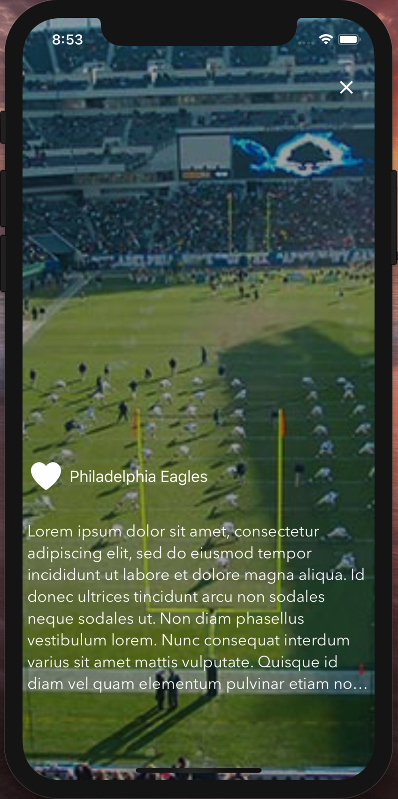

## VividApp

 smooth transition after tapping an item -> 

### This is a simple application showing the following functionality:

* Invoking REST API asynchronously
* Render JSON respose into a Table view in an smooth way.
* Perform some smooth transitions when a cell of the table view is tapped.
* Unit tests.

### The following components will be used:

* [ChamaleonFramework](https://github.com/viccalexander/Chameleon) for cool colors
* [Alamofire](https://github.com/Alamofire/Alamofire) for networking and REST API invokation
* [Hero](https://github.com/HeroTransitions/Hero) for smooth transition animations.

### How to build

##### Prerequisites to build 
* you need to install [Cocoapods](https://cocoapods.org)

##### Building process

* git clone https://github.com/ivanmejiarocha/vivid_experiment.git
* type the following commands on the Terminal:

        $ cd vivid_experiment/VividApp
        $ pod install
        $ open VividApp.xcworkspace
    
* On Xcode

    * Command + B ( to build )
    * Command + R ( to build and run )
    
* You'r done!
